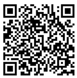
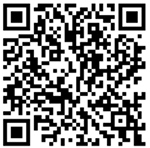
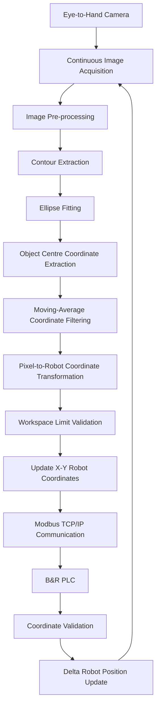

# Real-Time Vision-Guided Delta Robot for Automated Material Handling

## Overview

This repository contains the implementation of my Master's thesis project:

**"Design and Implementation of an Integrated Real-Time Vision-Guided Robotic Systems Algorithm for Automated Material Handling"**

The project presents an integrated vision-guided robotic system for automated
material handling using a Delta robot.

The developed system combines computer vision, industrial PLC control,
robotic manipulation, and real-time communication to detect objects,
determine their positions, and control the Delta robot based on coordinates
obtained from the vision system.

Two independent vision-guided applications were developed:

1. **Vision-Guided Pick-and-Place**
   - Uses an eye-in-hand camera configuration.
   - Detects stationary circular objects.
   - Calculates the object centre position.
   - Converts image pixel coordinates into robot coordinates.
   - Transfers the coordinates to the PLC.
   - Performs automatic pick-and-place using the Delta robot and vacuum gripper.

2. **Real-Time Object Tracking**
   - Uses an eye-to-hand camera configuration.
   - Continuously detects and tracks the object position.
   - Updates the object's X-Y coordinates in real time.
   - Transfers updated coordinates to the PLC.
   - Allows the Delta robot to respond to changes in object position.
  
## Demonstration Videos

The QR codes below provide access to demonstration videos of the implemented system.

### Vision-Guided Pick-and-Place

Scan the QR code below to view the demonstration of the automated vision-guided pick-and-place operation.



### Real-Time Object Tracking

Scan the QR code below to view the demonstration of the real-time object tracking and pick-and-place operation.




## System Architecture

The system integrates the following major components:

- **Raspberry Pi 5** – Vision processing and coordinate calculation
- **Logitech BRIO 105 cameras** – Image acquisition
- **Python** – Vision algorithm implementation
- **OpenCV** – Image processing and object detection
- **B&R X20CP0484-1 PLC** – Robot motion control and sequencing
- **B&R Automation Studio** – PLC development environment
- **Modbus TCP/IP** – Communication between Raspberry Pi and PLC
- **Delta Robot** – Robotic manipulation
- **Arduino** – Vacuum gripper control
- **Vacuum Gripper** – Object picking and releasing


## System Workflow

The overall information flow of the developed system is shown below:


## Vision Processing

The Raspberry Pi 5 acts as the main vision-processing controller.

The vision pipeline includes:

- Image acquisition
- Image preprocessing
- Thresholding
- Noise reduction
- Contour detection
- Circular object detection
- Centre-coordinate extraction
- Object tracking
- Coordinate filtering
- Workspace validation

Python and OpenCV are used to process camera frames and calculate the
position of detected objects.


## Vision-Guided Pick-and-Place

The pick-and-place application uses an **eye-in-hand camera** mounted near
the Delta robot end effector.

The sequence is:

1. The PLC sends a trigger to the Raspberry Pi.
2. The camera captures the robot workspace.
3. The image is processed using OpenCV.
4. Circular objects are detected.
5. The centre coordinates of valid objects are calculated.
6. Pixel coordinates are transformed into robot workspace coordinates.
7. Coordinates are transferred to the B&R PLC using Modbus TCP.
8. The PLC validates the received coordinates.
9. The Delta robot moves to the calculated position.
10. The vacuum gripper picks the object.
11. The robot moves to the predefined placement position.
12. The object is released.

Circular objects are identified using contour analysis and diameter
filtering.


## Object Tracking

A separate **eye-to-hand camera** configuration is used for real-time object
tracking.

Unlike the pick-and-place application, where the object position is detected
before the robot begins its motion, the tracking application continuously
captures image frames and repeatedly updates the detected object position.

During the tracking phase, the eye-to-hand camera continuously monitors the
object position and updates the X-Y coordinates. A moving-average filter is used
to stabilize the detected coordinates. When the detected object remains stable
within the predefined tolerance for the required stabilization period, the final
coordinates are transferred to the PLC and the robot initiates the pick-and-place
sequence.

The object-tracking workflow is shown below:



The object's centre coordinates are continuously recalculated and transmitted
to the B&R PLC. The PLC validates the received coordinates and updates the
Delta robot position within the permitted workspace. The robot follows the
object in the **X and Y directions**, while the Z-axis remains at a predefined
safe tracking height.

The object's position is continuously updated so that the robot can react
to changes in its location within the defined workspace.


## Coordinate Transformation

The camera initially provides the detected object's location in image pixel
coordinates.

A camera calibration procedure and affine coordinate transformation are used
to convert these pixel coordinates into Delta robot workspace coordinates.

The transformation can be represented as:

[Xrobot]   [a  b  c] [u]
[Yrobot] = [d  e  f] [v]
                     [1]

where:

- `u, v` = image pixel coordinates
- `Xrobot, Yrobot` = robot workspace coordinates

The calibrated transformation allows the vision system to provide coordinates
that can directly be used for robotic positioning.


## PLC Communication

Communication between the Raspberry Pi 5 and B&R PLC is implemented using
**Modbus TCP/IP over Ethernet**.

The Raspberry Pi operates as the Modbus TCP client, while the B&R PLC
operates as the server.

The communication includes:

- Object coordinates
- Sequence information
- Object count
- Trigger signals
- Completion signals
- Synchronization flags

A handshake mechanism synchronizes the vision-processing and robot-control
operations.


## PLC Control

The robot control program is implemented using **Structured Text (ST)**
in B&R Automation Studio.

The PLC is responsible for:

- Receiving vision coordinates
- Validating coordinate limits
- Robot motion sequencing
- Pick-and-place execution
- Tracking movement
- I/O handling
- Gripper commands
- Communication synchronization
- Safety and error handling


## Hardware

| Component | Purpose |
|------------|---------|
| B&R X20CP0484-1 PLC | Robot control |
| Raspberry Pi 5 | Vision processing |
| Logitech BRIO 105 | Image acquisition |
| Delta Robot | Robotic manipulation |
| B&R Stepper Modules | Motor control |
| Arduino | Gripper control |
| Vacuum Gripper | Object handling |
| Mean Well 24 V Power Supply | PLC power supply |


## Software and Technologies

### Programming

- Python
- Structured Text (IEC 61131-3)

### Computer Vision

- OpenCV
- NumPy

### Industrial Automation

- B&R Automation Studio
- PLC programming
- Motion control
- Digital I/O

### Communication

- Modbus TCP/IP
- Ethernet
- PyModbus

### Hardware Platforms

- Raspberry Pi 5
- B&R X20 PLC
- Arduino
- Logitech camera
- Delta robot


## Validation

The developed system was experimentally evaluated through several tests:

- Shape identification
- Object diameter variation
- Lighting-condition testing
- Workspace limitation testing
- Pixel-to-robot coordinate accuracy
- Pick-and-place performance
- Object tracking performance
- Communication performance

The coordinate transformation achieved positioning errors of **less than
1 mm in the performed validation tests**.

The pick-and-place vision system demonstrated reliable object detection under
the tested illumination conditions.

The object-tracking system was more sensitive to lighting variations and
performed reliably under suitable illumination conditions.

## Experimental Results

| Test | Result |
|---|---|
| Pick-and-place trials | 50 |
| Successful picks | 50 |
| Pick-and-place success rate | 100% |
| Average cycle time | 22.2 s |
| Tracking tests | 30 |
| Tracking success rate | 98% |
| Average tracking position error | 2.5 mm |
| Maximum tracking position error | 4.0 mm |
| Modbus messages tested | 100 |
| Communication success rate | 100% |
| Average response time | 45 ms |
| Maximum response time | 70 ms |## Experimental Results

| Test | Result |
|---|---|
| Pick-and-place trials | 50 |
| Successful picks | 50 |
| Pick-and-place success rate | 100% |
| Average cycle time | 22.2 s |
| Tracking tests | 30 |
| Tracking success rate | 98% |
| Average tracking position error | 2.5 mm |
| Maximum tracking position error | 4.0 mm |
| Modbus messages tested | 100 |
| Communication success rate | 100% |
| Average response time | 45 ms |
| Maximum response time | 70 ms |


## Key Contributions

The main contributions of the project include:

- Development of an integrated vision-guided Delta robot system
- Integration of Raspberry Pi-based machine vision with industrial PLC control
- Circular object detection using image processing and diameter filtering
- Real-time object tracking using contour extraction and ellipse fitting
- Pixel-to-robot coordinate transformation using camera calibration
- Modbus TCP communication between Raspberry Pi and B&R PLC
- PLC-based coordinate validation and robot motion control
- Automated vacuum-gripper-based pick-and-place operation
- Experimental validation of vision, communication, tracking, and positioning


## Repository Structure

```text
Real-time-vision-guided-delta-robot/
│
├── pick-and-place/
│   ├── python/                 # Python vision and Modbus communication code
│   └── plc/                    # B&R PLC programs for pick-and-place control
│
├── object-tracking/
│   ├── python/                 # Real-time object detection and tracking
│   └── plc/                    # PLC programs for vision-guided robot tracking
│
├── images/                     # Images of setup, experiments, and results
│
├── docs/                       # Project and technical documentation
│
├── videos/                     # Demonstration and testing videos
│
├── requirements.txt            # Required Python packages
└── README.md                   # Project overview and instructions
